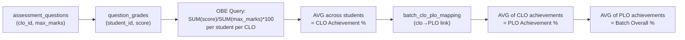

# CLO / PLO / OBE Reporting System — Full Audit

## Executive Summary

The OBE system follows a **sound architectural pipeline**: questions are tagged with CLOs → student scores are recorded per-question → OBE reports aggregate scores per-CLO and propagate to PLOs via mappings. The core calculation logic in [obeRoutes.js](file:///d:/FYP/FYP-LMS/backend/routes/obeRoutes.js) is **fundamentally correct** for the data it processes. However, there are **several issues** ranging from critical calculation flaws to missing edge-case handling that can produce misleading or incomplete OBE reports.

---

## Data Pipeline Overview



---

## Issues Found

### 🔴 CRITICAL — Issue #1: Division by Zero / NULL on Unmapped Questions

**Location:** [obeRoutes.js:43](file:///d:/FYP/FYP-LMS/backend/routes/obeRoutes.js#L43) and [obeRoutes.js:75](file:///d:/FYP/FYP-LMS/backend/routes/obeRoutes.js#L75)

**Problem:** The core OBE calculation is:
```sql
(SUM(qg.score) / SUM(aq.max_marks)) * 100 as student_clo_percent
```
This `JOIN`s on `aq.clo_id = clo.id`, which **silently excludes** any questions where `clo_id IS NULL`. If a faculty member creates questions but forgets to tag them with a CLO, those scores are **invisible** to the OBE system. There is **no warning** to the user.

**Impact:** OBE reports can show artificially low percentages (because scores from untagged questions are excluded from the denominator), or show **nothing at all** for a course if no questions are tagged.

**Fix:**
1. Add a validation warning on the assessment creation/grading UI: _"⚠ X questions are not mapped to any CLO — they will not count towards OBE."_
2. Optionally show an "Unmapped Questions" alert on the OBE Reports page.

---

### 🔴 CRITICAL — Issue #2: CLO Achievement Aggregation Ignores Assessment Weight

**Location:** [obeRoutes.js:43](file:///d:/FYP/FYP-LMS/backend/routes/obeRoutes.js#L43)

**Problem:** The OBE query calculates CLO achievement as:
```sql
SUM(qg.score) / SUM(aq.max_marks) * 100
```
This treats a 10-mark quiz question and a 50-mark final exam question **equally** within the same CLO — raw marks are simply summed. However, the `assessments` table has a `weight` column (e.g., Quiz 5%, Midterm 30%, Final 40%) that is **completely ignored**.

**Impact:** A student who scores 10/10 on a 5%-weight quiz and 20/50 on a 40%-weight final for the same CLO would show:
- **Current calculation:** `(10+20)/(10+50)*100 = 50%`
- **Correct weighted:** should favor the final exam heavily

**Fix:** The inner query should multiply scores by the assessment's weight:
```sql
(SUM(qg.score * a.weight) / SUM(aq.max_marks * a.weight)) * 100
```
Or alternatively, compute per-assessment CLO percentages first, then take a weighted average.

> [!IMPORTANT]
> This is the most impactful calculation bug. The current system gives equal importance to a 5% quiz and a 40% final exam when computing CLO attainment. This produces **mathematically incorrect** OBE results.

---

### 🟠 HIGH — Issue #3: PLO Achievement Double-Counts Multi-Mapped CLOs

**Location:** [obeRoutes.js:61-91](file:///d:/FYP/FYP-LMS/backend/routes/obeRoutes.js#L61-L91)

**Problem:** The PLO query calculates PLO achievement as the **AVG** of all CLO achievements mapped to that PLO. If a single CLO is mapped to **multiple PLOs**, the same CLO score contributes to each PLO independently — which is correct behavior.

However, when calculating the **batch overall achievement** (line 134-136):
```js
const overallAchievement = batchPLOs.length > 0 
    ? Math.round(batchPLOs.reduce((acc, p) => acc + p.achievement, 0) / batchPLOs.length)
    : 0;
```
This gives **equal weight to every PLO**, regardless of how many CLOs feed into it. A PLO backed by 10 CLOs and a PLO backed by 1 CLO have equal influence on the overall batch score. This is a design choice, not a bug per se, but it can produce misleading results.

**Impact:** Batch overall achievement can be skewed by PLOs with very few data points.

---

### 🟠 HIGH — Issue #4: Ungraded PLOs Show as 0% (Not "No Data")

**Location:** [obeRoutes.js:119-203](file:///d:/FYP/FYP-LMS/backend/routes/obeRoutes.js#L119-L203)

**Problem:** The backend fetches all attached PLOs (`attachedPLOs`) but only populates achievement data for PLOs that appear in `ploRows` (i.e., PLOs that have graded data flowing through the CLO→PLO mapping). PLOs with no data are simply **missing** from the `batchPLOs` array.

On the frontend, this means a batch with 12 PLOs where only 3 have been assessed will show:
- 3 PLO cards with achievement data
- 9 PLOs completely absent from the report
- The "Total PLOs" counter shows `totalPLOs: 12` but only 3 PLOs render

**Impact:** Users can't distinguish between "this PLO has 0% achievement" vs "this PLO hasn't been assessed yet." Ungraded PLOs should appear in the report with a "Not Yet Assessed" badge.

---

### 🟡 MEDIUM — Issue #5: Semester Achievement Uses CLO Count, Not Course Count

**Location:** [obeRoutes.js:191](file:///d:/FYP/FYP-LMS/backend/routes/obeRoutes.js#L191)

**Problem:**
```js
achievement: s.cloCount > 0 ? Math.round(s.totalAchievement / s.cloCount) : 0
```
Semester achievement is the average of all CLO achievements within that semester. A course with 5 CLOs contributes 5× more to the semester average than a course with 1 CLO. This is potentially misleading since the academic convention is usually to average **per course**, not per CLO.

**Impact:** Semester percentages may not match user expectations if courses have unequal numbers of CLOs.

---

### 🟡 MEDIUM — Issue #6: No Validation That question_grades Link to Correct CLOs

**Location:** [assessmentRoutes.js:162-181](file:///d:/FYP/FYP-LMS/backend/routes/assessmentRoutes.js#L162-L181)

**Problem:** When creating an assessment, questions can have a `clo_id` field. There is **no validation** that the `clo_id` belongs to a CLO that is actually mapped to the course. A faculty member could accidentally tag a question with a CLO from a different course, and the OBE system would silently include those scores in the wrong CLO's calculation.

**Impact:** Cross-course CLO contamination in OBE reports.

**Fix:** Add a validation check:
```sql
SELECT id FROM clos WHERE id = ? AND course_id = (SELECT course_id FROM course_assignments WHERE id = ?)
```

---

### 🟡 MEDIUM — Issue #7: Download Buttons Are Stubs

**Location:** [OBEReports.jsx:43-53](file:///d:/FYP/FYP-LMS/frontend/src/pages/admin-pages/OBEReports.jsx#L43-L53)

**Problem:** The "Download PLO Report" and "Download CLO Report" buttons show `alert()` messages instead of generating actual downloadable reports.

```js
const handleDownloadPLO = (e, batchName) => {
    e.stopPropagation();
    alert(`Downloading PLO Report for ${batchName}...`);  // ← stub
};
```

**Impact:** Users cannot export OBE data. For an FYP presentation, this is a visible incomplete feature.

---

### 🔵 LOW — Issue #8: `totalPLOs` Fallback to 12

**Location:** [obeRoutes.js:199](file:///d:/FYP/FYP-LMS/backend/routes/obeRoutes.js#L199)

```js
totalPLOs: totalPLOs || 12, // fallback if no PLOs attached
```

**Problem:** If a batch has no PLOs attached, it defaults to 12. This is misleading — the UI will show "12 PLOs" when there are actually 0. The frontend should display a warning like "No PLOs attached to this batch."

---

## What's Working Well ✅

| Area | Status |
|------|--------|
| Question-level grading (`question_grades` table) | ✅ Solid — proper UPSERT, validation |
| CLO-to-question mapping at assessment level | ✅ Correct — `assessment_questions.clo_id` |
| Batch-scoped CLO-PLO mappings | ✅ Good architecture — `batch_clo_plo_mapping` |
| Course-scoped mapping save (with course_id scope) | ✅ Correct delete+insert pattern |
| Faculty scope enforcement on grading | ✅ Ownership checks present |
| Multi-PLO mapping per CLO | ✅ Handled correctly via junction table |
| SQL injection prevention | ✅ Parameterized queries throughout |
| Department-scoped OBE reports | ✅ Correct `department_id` filtering |

---

## Priority Fix Recommendations

| Priority | Issue | Effort | Impact |
|----------|-------|--------|--------|
| 🔴 P0 | #2 — Add assessment weight to CLO calculation | Medium | Fixes fundamental calculation error |
| 🔴 P0 | #1 — Warn about untagged questions | Low | Prevents silent data loss |
| 🟠 P1 | #4 — Show ungraded PLOs as "Not Assessed" | Low | Improves report clarity |
| 🟡 P2 | #6 — Validate CLO belongs to correct course | Low | Prevents cross-contamination |
| 🟡 P2 | #7 — Implement actual report download | Medium | Completes the feature |
| 🟡 P2 | #5 — Use per-course averaging for semesters | Low | Better academic accuracy |
| 🔵 P3 | #8 — Remove totalPLOs: 12 fallback | Trivial | Cosmetic fix |
| 🟠 P1 | #3 — Weighted overall batch achievement | Low | Better representation |
